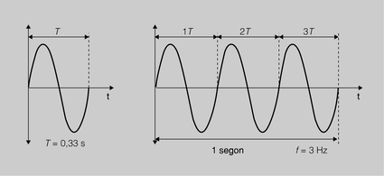
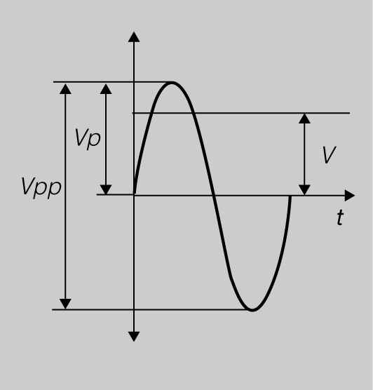
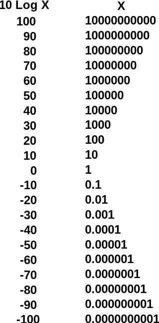
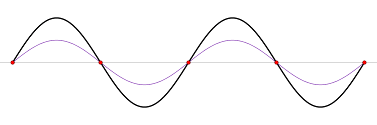
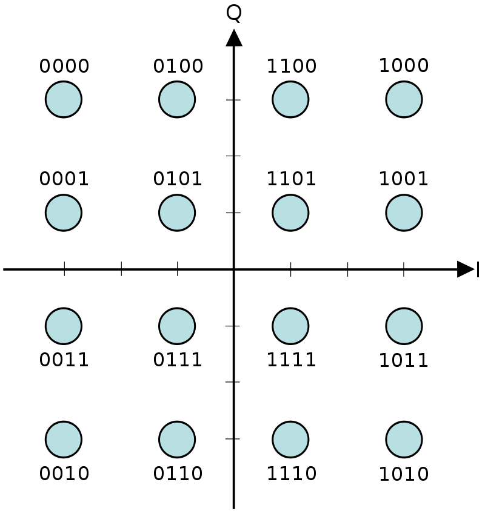

UD1 - COMPROBACIÓN DE LOS PARÁMETROS DE LAS SEÑALES DE TELEVISIÓN ANALÓGICA Y DIGITAL
=======================================================================

Índice
======

1. Características de las señales electromagnéticas.
2. Magnitudes y unidades de las señales electromagnéticas de 
radiodifusión.

3. Medición de señales analógicas y digitales.
4. Identificación de banda, canal y portadora.
5. La televisión analógica:
    * Medición de parámetros de la señal de televisión analógica.
    * Codificación de la señales analógica de TV.
    * Normas RTMA y CCIR.
6. La Televisión digital:
    * Conversión señales analógicas a digitales.
    * Parametrización y caracterización de la señal codificada de 
televisión digital.

7. Modulación:
    * Tipos.
    * Características.
    * Utilización del medidor de campo en las señales de televisión 
analógica y digital.

Introducción
============

Supongamos que nuestra empresa está realizando una _ICT_ 
en un edificio de viviendas y en la reunión se nos comunica que la 
_onda electromagnéetica_ de la _UHF_ llega con pocos _dB_, una _C/N_
pobre y con un _BER_ muy alto para la modulación _COFDM_ lo cual da
problemas a la _TDT_. Además se quiere recibir el _DAB_ y la 
señal de _banda alta_ y _polarización horizontal_ del satélite ASTRA.
Al acabar la reunión se nos pregunta si estamos de acuerdo en los
nuevos requerimientos.

01 - Características de las señales electromagnéticas
=====================================================

01.01 - Características generales
---------------------------------

Las señales de televisión y radio son emitidas mediante ondas 
electromagnéticas de diferentes frecuencias. Estas ondas son captadas 
en las instalaciones receptoras, siempre que las antenas sean 
adecuadas, no haya interferencias u obstáculos.

Las ondas electromagnéticas se producen cuando una carga eléctrica se
acelera (aumenta su velocidad, frena, gira, cambia de dirección).
Cuando esto pasa se produce un fotón que también puede interpretarse
como una oscilación de un campo eléctrico y uno magnético paralelos
entre sí.

Cuando esta onda topa con una antena induce una fuerza electromotriz
(un microvoltaje) en sus extremos.

01.02 - Polarización de la onda
-------------------------------

> La polarización describe la dirección de oscilación en el plano
> perpendicular al que viaja la onda.

Dicho de otro modo es como vibra la onda. Puede ser:
* sin polarizar: vibra en todas las direcciones
* polarizada linealmente el campo eléctrico vibra en un solo plano
    - horizontal: es horizontal respecto a la superficie
    - vertical: vertical respecto a la superficie terrestre
* polarización circular: el campo eléctrico gira mientras se propaga
    - dextrógira: en el sentido de las agujas del reloj
    - levógira: en el sentido contrario

Sucederá un tipo de polarización u otro dependiendo de la orientación 
del dipolo de la antena emisora.

Por otra parte, se inducirá en la antena receptora la máxima fuerza
electromotriz cuando la antena tenga la misma dirección que la
polarización de la señal.

Esta inducción es la que crea las corrientes que viajan por el cable
coaxial por el circuito de RTV.

02 - Magnitudes y unidades
==========================

02.01 - Frecuencia y longitud de onda
------------------------------------------------

Se definen los siguientes conceptos:

* **Onda:** Es la transmisión de una perturbación, de tal manera que se
transmite energía pero no materia. Como las ondas superficiales del
agua al tirar una piedra, los cambios de densidad en el aire al hablar
o en nuestro caso las ondas electromagnéticas al acelerar un electrón.

* **Onda electromagnética:** Aquella que se produce por la oscilación
consecutiva de un campo eléctrico y otro magnético perpendicular al
primero.

* **Velocidad de propagación:** Es el espacio que recorre la 
perturbación en un tiempo determinado. Se mide en m/s, km/h, o km/s
 
* **Periodo:** Es el tiempo que tarda la onda en _"repetirse"_. Se
mide en segundos.

* **Frecuencia:** Es el numero de ciclos completos que realiza la onda
en un segundo. Se mide en Hz (un Hz es un ciclo/s). Es análogo a las
revoluciones por minuto 1Hz = 60rpm. Dada la gran velocidad de la luz,
es habitual utilizar múltiplos del Hz, así:
    - 1 kHz son 1.000 Hz
    - 1 MHz son 1.000 kHz o 1.000.000 de Hz
    - 1 GHz son 1.000 MHz, 1.000.000 kHz o 1.000.000.000Hz

02.02 - Amplitud de onda
------------------------

Las ondas electromagnéticas tienen forma sinusoidal. La amplitud de onda
(cómo de alta es), determina su intensidad y corresponde al valor del
campo eléctrico de la carga acelerada.

Relacionados con la amplitud de onda existe los siguientes conceptos:
* **Valor de pico (V-p):** es el valor máximo al que puede llegar la 
onda.

* **Valor de pico a pico (V-pp):** es el valor que hay entre el valor 
pico positivo y el negativo.

* **Valor eficaz: (V)** Es el valor que tiene un corriente continuo que
aplicado en una resistencia produce la misma disipación de potencia que
el corriente alterno valorado.

* **Longitud de Onda (%lambda):**, es la distancia que recorre una
oscilación completa.

Las siguientes formulas relacionan estas características:
~~~
f = c over %lambda
%lambda = c over f
~~~

* lambda en metros
* f en kHz
* c en km/s 

**Ejemplo (02.01):** 
> Para una frecuencia de 100MHz ¿que longitud de onda tengo?
> 
> Primero hay que fijarse en que la frecuencia nos la dan en MHz 
> (mega hercios) y nosotros la necesitamos en kHz. Cada MHz equivale 
> a 1000kHz, así que 100MHz son 100.000kHz
> 
> Ahora que todo está en las unidades correctas, podemos aplicar la
> fórmula:

    %lambda = c over f = 300.000 over 100.000 = 3

> La longitud de onda es de 3 metros.

02.03 - Magnitudes de la señal
------------------------------

Las magnitudes son las mismas que los circuitos eléctricos en realidad.
Sólo que en estos casos la potencia es mucho más baja y las unidades se
adaptan a estos valores:

* **Fuerza electromotriz inducida (femi):** Es el voltaje (la tensión)
que se induce en la antena receptora. Su unidad habitual será:
    - **µV** 1µV equivale a 0.000001V
    - **mV** 1mV equivale a 0.001V

* **Tensión o diferencia de potencial V o ddp:** Diferencia de valores
entre un polo y otro del circuito. Las unidades son las mismas que en
el caso anterior.

* **Impedancia del circuito (Z):** Oposición que ejerce todo circuito,
debido a sus conexiones y componentes, al paso de la corriente 
eléctrica. En los circuitos de RTV se establece una impedancia
característica de 75Ω.

* **Intensidad (I):** Movimiento de electrones por segundo en el
circuito. Su unidad más habitual será el µA o el mA.
Se puede calcular a partir de la tensión mediante la ley de Ohm:

    I = V over Z

* **Potencia (P):** Es la energía por unidad de tiempo que se utiliza en
el circuito. Se calcula como:

    P = V times I

02.04 - Decibelios
------------------
Es una unidad adimensional, ya que en sí no es una unidad de medida.
En realidad es una relación entre dos valores, de manera similar a un
porcentaje, sólo que a diferencia de los valores porcentuales, el
decibelio no es lineal sino logarítmica.

Imaginemos que queremos comparar valores con ordenes de magnitud muy
diferente, como por ejemplo el valor de una barra de pan, de una
vivienda, de una empresa del IBEX y de la deuda de un país.

Es difícil establecer comparaciones entre valores con tanta diferencia
en el número de dígitos.

En cambio con una escala logarítmica, cada diez decibelios es un orden
de magnitud:

Continuando con el ejemplo de la barra de pan:

|     Item    |       Valor       |Valor en dB€|
|:------------|------------------:|-----------:|
|Barra de pan |              1,40€|           1|
|Vivienda     |           230.000€|          54|
|Valor Inditex|        90.102.000€|          79|
|PIB España   | 1.757.000.000.000€|         122|

Con la escala logarítmica se puede ver que la proporcion entre una
vivienda y la empresa con mayor cotización del país está mucho más
próxima que la de una barra de pan y una vivienda. Además se manejan
menos dígitos, con lo que es sencillo manejar estas cantidades.

Como hemos dicho els dB comparan una cantidad con otra, en el ejemplo
anterior el valor de referencia era 1€, por lo tanto es un valor en 
decibelios, en valor absoluto, por eso se añade la unidad después de 
los dB (dB€):

    V_dB = 10 times left ( V over 1€ right )

Donde:
* **V\_dB:** es el valor en decibelios
* **V:** es el valor en €

Pero puede ser cualquier valor de referencia, por ejemplo la proporcion
entre la potencia de entrada y la salida se da en decibelios de 
ganancia en este caso se da en dB:

    V_dB = 10 times left ( P_ent over P_sal right )

Donde:

* **V\_dB:** es el valor en decibelios
* **P\_ent:** es la potencia de entrada
* **P\_sal:** es la potencia de salida

03 - Medición de señales analógicas y digitales
===============================================

> El nivel de señal se define como la tensión desarrollada sobre una
impedancia de 75 ohmios, debido a la distribución de potencia de señal
sobre un ancho de banda.

Este parámetro se mide con un medidor de campo, configurado según si lo
que se desea medir es una señal analógica o digital.

Además, los medidores de campo nos servirán para medir, entre otros:
    - La potencia de la señal analógica y digital en dBµV o dBm
    - La relación C/N
    - Demodulación A/V
    - Ajuste de la polarización cruzada del LNB
    - La tasa BER
    - La relación S/N en dB

Finalmente de un tiempo a esta parte, la mayoria de medidores de campo
permiten seleccionar la constelación de cualquier portadora de datos
del canal.

04 - Identificación de banda, canal y portadora
===============================================

04.01 - El espectro electromagnético
------------------------------------

Las diferentes frecuencias clasifican lo que se llama el espectro
electromagnético: ondas de radio, televisión, microondas, infrarrojos,
luz visible, ultravioleta, rayos X, rayos gamma, etc.

Este espectro se divide en bandas o segmentos:

|     Nombre     | Frecuencias |Longitud de onda|
|----------------|------------:|---------------:|
|Radiofrecuencia |      <300MHz|             >1m|
|Microondas      |300MHz-300GHz|          1m-1mm|
|Infrarrojo      |300GHz-430THz|       1mm-700nm|
|Luz visible     |430THz-789THz|     700nm-380nm|
|Ultravioleta    | 789THz-30PHz|      380nm-10nm|
|Rayos X         |  30PHz-30EHz|       10nm-10pm|
|Rayos gamma     |       >30EHz|           <10pm|

04.02 - El espectro radioeléctrico
----------------------------------

> Sucesión ordenada de las longitudes de onda (o frecuencias) que
> intervienen en los fenómenos electromagnéticos.

Si dejamos de lado todo con una longitud de onda inferior al umbral del
infrarrojo hasta la longitud de onda más larga posible estaríamos 
hablando del espectro radioeléctrico.

Cabe destacar que para que la onda electromagnética pueda atravesar
el aire, la frecuencia tiene que ser superior a 10kHz. Por eso estas
frecuencias se denominan radiofrecuencias.

|   Nombre    |Abreviatura|Banda|Frecuencias|Longitud de onda|
|-------------|:---------:|:---:|----------:|---------------:|
|Muy baja fr. |    VLF    |  4  |    3-30kHz|        100-10km|
|Baja frecuen.|     LF    |  5  |  30-300kHz|          10-1km|
|Media frec.  |     MF    |  6  |300-3000kHz|       1000-100m|
|Alta frecuen.|     HF    |  7  |    3-30MHz|         100-10m|
|Muy alta fr. |    VHF    |  8  |  30-300MHz|           10-1m|
|Ultra alta f.|    UHF    |  9  |300-3000MHz|      1000-100mm|
|Super alta f.|    SHF    | 10  |    3-30GHz|        100-10mm|
|Extra alta f.|    EHF    | 11  |  30-300GHZ|          10-1mm|

Al ser las longitudes de onda tan diferentes, los fenómenos asociados
a ellas ocurrirán a diferentes escalas, por ejemplo la difracción de
las ondas VLF y LF ocurrirá con prácticamente cualquier obstáculo,
por grande que sea este y se propagaran por lo tanto como ondas de
superficie, es decir, se propagarán pegadas al suelo, venciendo
desniveles e incluso la curvatura de la Tierra. 

Por otra parte las ondas con longitud de onda más corta se absorberán
o reflejarán pero no se difractarán por los obstáculos terrestres 
(aunque si por la troposfera) y por lo tanto se propagarán como ondas 
de espacio.

Finalmente señalar que algunas frecuencias de radio de frecuencia
media 300-3000kHz pueden reflejarse en las capas de gas ionizado de la 
ionosfera lo cual permite su propagación más allá del horizonte.

### Bandas del servicio de radiodifusión sonora y televisión

Dentro del espectro radioeléctrico se han definido ciertas 
ordenaciones. Así tenemos que:

|Abr. |    Nombre   |   Frecuencias  |
|:---:|:-----------:|---------------:|
|RADIO|  Onda larga |0,15 - 0,285 MHz|
|RADIO|  Onda media |0,52 - 1,605 MHz|
|RADIO|  Onda corta |  2,3 - 26,1 MHz|
| VHF |   Banda I   |     47 - 68 MHz|
| VHF |Banda II (FM)|    87 - 110 MHz|
| VHF |  Banda III  |   164 - 230 MHz|
| UHF |  Banda IV   |   470 - 606 MHz|
| UHF |   Banda V   |   606 - 862 MHz|
| Ku  |FSS Banda Inf| 10,7 - 11,7 GHz|
| Ku  |     DBS     | 11,7 - 12,5 GHz|
| Ku  |FSS Banda Sup|12,5 - 12,75 GHz|

Las bandas estan divididas en canales y cada canal tiene una frecuencia
que depende del estandar así como de cada país.

Las frecuencias:
- de 0,15 a 26,1 MHz se utilizan para las emisiones de radio
- de 195 a 223 MHz se utilizan para el DAB (audio digital).
- de 47 a 862 MHz para la TV terrestre.

> **Nota:** La banda Ku se encuentra en el espectro de las microondas
> y suele utilizarse para las señales de TV-SAT, esta banda se divide 
> en varios segmentos que cambian según la parte del planeta siguiendo
> directrices de la UTI (Unión Internacional de Telecomunicaciones.

### Ordenación de la banda VHF

Dentro del VHF se subdividen las siguientes bandas:

| Banda |Canal|Frecuencia Canal (MHz)|
|:-----:|:---:|---------------------:|
|  B I  |  2  |               47 - 54|
|  B I  |  3  |               54 - 61|
|  B I  |  4  |               61 - 68|
|  B II |  FM |              88 - 108|
| B III |  5  |             174 - 181|
| B III |  6  |             181 - 188|
| B III |  7  |             188 - 195|
| B III |  8  |             195 - 202|
| B III |  9  |             202 - 209|
| B III | 10  |             209 - 216|
| B III | 11  |             216 - 223|
| B III | 12  |             223 - 230|

### Ordenación de la banda UHF

Dentro del UHF, que comprende las frecuencias entre 470MHz y 862MHz se
subdividen canales de 8MHz cada uno, es decir _"trozos"_ del espectro
donde estan todas las frecuencias utilizadas para reproducir imagenes y
sonido.

|Bandas|Canal|Frecuencia Canal (MHz)|
|:----:|:---:|---------------------:|
| B IV | 21  |            470...478 |
| B IV | 22  |            478...486 |
| B IV | 23  |            486...494 |
| B IV | 24  |            494...502 |
| B IV | 25  |            502...510 |
| B IV | 26  |            510...518 |
| B IV | 27  |            518...526 |
| B IV | 28  |            526...534 |
| B IV | 29  |            534...542 |
| B IV | 30  |            542...500 |
| B IV | 31  |            550...558 |
| B IV | 32  |            558...566 |
| B IV | 33  |            566...574 |
| B IV | 34  |            574...582 |
| B IV | 35  |            582...590 |
| B IV | 36  |            590...598 |
| B IV | 37  |            598...606 |
| B V  | 38  |            606...614 |
| B V  | 39  |            614...622 |
| B V  | 40  |            622...630 |
| B V  | 41  |            630...638 |
| B V  | 42  |            638...646 |
| B V  | 43  |            646...654 |
| B V  | 44  |            654...662 |
| B V  | 45  |            662...670 |
| B V  | 46  |            670...678 |
| B V  | 47  |            678...686 |
| B V  | 48  |            686...694 |
| B V  | 49  |            694...702 |
| B V  | 50  |            702...710 |
| B V  | 51  |            710...718 |
| B V  | 52  |            718...726 |
| B V  | 53  |            726...734 |
| B V  | 54  |            734...742 |
| B V  | 55  |            742...750 |
| B V  | 56  |            750...758 |
| B V  | 57  |            758...766 |
| B V  | 58  |            766...774 |
| B V  | 59  |            774...782 |
| B V  | 60  |            782...790 |
| B V  | 61  |            790...798 |
| B V  | 62  |            798...806 |
| B V  | 63  |            806...814 |
| B V  | 64  |            814...822 |
| B V  | 65  |            822...830 |
| B V  | 66  |            830...838 |
| B V  | 67  |            838...846 |
| B V  | 68  |            846...854 |
| B V  | 69  |            854...862 |

> **Nota importante:** En el 2014 los canales 60 a 69 se reasignaron
> para señales de telefonía móvil 4G/LTE, y a desde el 2020 los canales
> 49 a 60 se han reasignado a señales de telefonía de 5G.

> El CNAF (Cuadro nacional de Atribución de Frecuencias), editado por
> primera vez en 1990 ha tenido varias ediciones.

04.03 - Portadora
-----------------

Una portadora es una onda electromagnética de alta frecuencia adecuada
para transmitir en la que mediante modulación se les anexa una señal de
baja frecuencia.

**Ejemplo:** 
Si ponemos en un tocadiscos un disco que solo emite la nota _LA_, el 
surco del vinilo hará vibrar la aguja del tocadiscos 440 veces por 
segundo, es decir 440Hz, esa es la frecuencia del _LA_, esa frecuencia 
no tiene problema en propagarse a través del aire como onda sonora, 
pero si queremos que ese _LA_ viaje de Manacor a Inca, no podemos 
utilizar ondas sonoras.

Decidimos por lo tanto utilizar ondas de radio (ondas 
electromagnéticas), para transformar una en otra utilizamos un 
micrófono y una antena, pero ya hemos visto que frecuencias de menos de
10kHz (10.000Hz)  tienen problemas para propagarse ya que su longitud 
de onda es mayor que la atmósfera de la Tierra (además de otros 
problemas). Así que no podemos simplemente transformar la onda sonora
a onda electromagnética de frecuencia 440, porque no la podremos
transmitir.

Lo siguiente que se nos ocurre es multiplicar una onda por otra, es
decir modulamos en amplitud la onda de mayor frecuencia. De esta
manera estamos transmitiendo una onda de frecuencia adecuada, la cual
a veces es un poco más intensa y otras un poco menos.

Cuando recibimos la señal demodulamos (quitamos la portadora), y nos
queda una señal de 440Hz que al pasar por el cable conectado a un
altavoz lo hace vibrar 440 veces cada segundo y que suene el _LA_ que
nos han enviado desde Manacor.

05 - La televisión analógica
============================

Las ondas portadoras, en la TV analógica se clasificaban en portadora
de vídeo (Pv), portadora de color (Pc) y portadora de sonido (Ps),
estas portadoras utilizaban los 8MHz del canal, aunque estaban
separadas una distancia según el estándar que se utilizase.

Por ejemplo con el estándar G (que se utilizaba en la TV analógica en 
la banda UHF), definía que:
- El ancho de banda seria de 8MHz
- La distancia entre Pv y la banda inferior debía ser 1,25MHz
- La distancia entre Ps y la Banda superior debía ser 1,25MHz
- La distancia entre Pv y Pc debía ser de 4,43MHz
- La distancia entre Pv y PS debía ser de 5,5MHz
- La diferencia del nivel de señal entre Pv y Pc de 16dB
- La diferencia en el nivel de señal entre Pv y Ps debía ser de entre 
10 y 13MHz

05.01 - Medición de parámetros de la señal de televisión analógica
------------------------------------------------------------------
Existen varios parámetros que intervienen en una instalación de
televisión analógica:

### 05.01.01 Ganancia en potencia

La ganancia en potencia es la diferencia de potencia entre dos puntos
diferentes (normalmente entre entrada y salida):

    G = 10 log P_2 over P_1

Donde:

* **G:** es la ganancia
* **P\_1:** es la potencia en la entrada
* **P\_2:** es la potencia en la salida

Considerando la misma impedancia resistiva y aplicando Ohm:

    G = 10 log P_2 over P_1 = 10 log { V_2^2 over overstrike R } over 
    { V_2^2 over overstrike R } = 10 log V_2^2 over V_1^2 = 20 log V_2
    over V_1

Donde:

* **V\_1:** es la tensión en la entrada
* **V\_2:** es la tensión en la salida

También se expresan en otras magnitudes en valores de potencia y
tensión absolutos: dBm, dBW, dBµV y dBmV.

Por ejemplo:
    G (dBm) = 10 log { P(mW) } over { 1(mW) }
    G (dBW) = 10 log { P(W) } over { 1(W) }
    V (dBµV) = 20 log { V(µV) } over { 1(µV) }
    V (dBmV) = 20 log { V(mV) } over { 1(mV) }

**Ejercicio 05.01.01 (I) :**
Que potencia tiene un equipo que la potencia en la salida es de 47dBm:

$
    G (dBm) = 10 log {P(mW)} over {1(mW)} toward log P(mW) = G over 10
    toward P (mW) = 10 ^ { G over 10 } = 10 ^ { 47 over 10 } = 50.118mW 
    = 50W
$

**Ejercicio 05.01.01 (II):**
Que tensión máxima en voltios mediremos en un amplificador que indica 
que su tensión de salida máxima es 113dBµV

    V (dbµV) = 20 log { V (µV) } over { 1 (µV) } towards 113 = 20 log
    V (µV) over 1 towards V (µV) = 10 ^ {113 over 20} = 10 ^ 5,65 = 
    446.683 µV = 0,4V

### 05.01.02 ROE (Relación de Onda Estacionaria)
Este parámetro es un factor de calidad entre una carga y una fuente e
indica que proporción de la onda es reflejada. 

Si la carga esta perfectamente emparejada con la fuente la onda 
reflejada es nula, la amplitud de la onda original será constante (ya 
que no hay reflejo que interfiera) por lo que la ROE será 1, y 
obtendremos la mayor potencia disponible, en cambio si se refleja parte
de la onda habrá puntos donde la onda sume a la original y puntos donde
reste y la ROE será mayor que 1. Finalmente en el caso de que se 
reflejase toda, habría puntos con valor 0 y la ROE tendería a infinito.

Se considera una adaptación correcta cuando la ROE es menor de 10dB

### 05.01.03 - La tasa BER en una señal digital

Aun con las bondades de la COFDM (Multiplexación por división de
frecuencias ortogonales codificada) veremos algo más de este sistema 
más adelante), algunos bits de información se ven alterados. La tasa 
BER (Bit Error Rate) es una medida de la calidad de la señal 
demodulada.

Sabemos los bits erróneos gracias al código adicional añadido como
control a los datos que sí nos interesan, como la letra del DNI.

La relación corresponde a la siguiente fórmula:

    S/N = 10 log P_S over P_R

Donde:

* **P\_S:** es la potencia de la señal
* **P\_R:** es la potencia del ruido

### 05.01.04 - La C/N en una señal digital

La C/N es la relación Portadora/Ruido (Carrier/Noise). Esta relación
afecta directamente a la tasa BER.

La C/N umbral, por debajo de la cual se imposibilita una correcta
decodificación, se establece en aquella que al ser reducida 1 dB
la tasa BER caiga por debajo de 0,03. Esto (en TDT) crearía en la 
imagen bloques coloreados pero sin contenido concreto.

La relación corresponde a la siguiente fórmula:

    C/N: 10 log P_C over P_R

Donde:

* **P\_C:** es la potencia de la portadora
* **P\_R:** es la potencia del ruido

En el RD 346/2011, se establece un C/N mínimo para cada una de las
posibles modulaciones digitales de TV:

* C/N QPSK-TV: >= 11dB
* C/N 64QAM-TV	>= 28dB
* C/N COFDM-DAB >= 18dB
* C/N COFDM-TV >= 25dB, (subportadoras moduladas con 64QAM)

### 05.01.05 - Distorsión

Indica cuanta señal de salida es diferente a la señal de entrada (en
amplitud y tiempo).

### 05.01.06 - Frecuencia de cuadro

Número de imágenes transmitidas por segundo, que según la norma europea
es de 25 fps

### 05.01.07 - Frecuencia de campo

Con el fin de evitar el parpadeo, se utiliza exploración entrelazada, 
por lo tanto cada cuadro esta formado por dos campos. Por ello la
frecuencia de campo para una frecuencia de cuadro de 25fps, la
frecuencia de campo es de 50fps.

### 05.01.08 - Otros datos relevantes

Otros valores a tener en cuenta para la calidad de la imagen son:

* Frecuencia de líneas
* Cantidad de líneas por cuadro
* Ancho de banda del canal
* Ancho de banda de vídeo
* Separación entre portadoras A/V
* Duración del impulso de sincronismo de línea
* Duración del impulso de sincronismo de cuadro

05.02 - Codificación de las señales analógicas de TV
----------------------------------------------------

Las imágenes y sonidos captados por una videocámara son transformados a
ondas electromagnéticas, cada una de estas ondas se modula, y se
combinan dentro del rango de frecuencias del canal a las distancias
y diferencias de señal especificadas por el estándar.

El receptor realizará el proceso inverso. La exploración es parecida
a la manera en la que se lee una página, de izquierda a derecha y de
arriba a abajo.

El sistema PAL europeo utiliza 625 de estas líneas y el NTSC americano 
525.

### 05.02.01 - Televisión en blanco y negro

Inicialmente la señal sólo transmitía información de luminancia, es
decir, la cantidad de intensidad con la que cada punto debe brillar.
Por solo hay diferentes grados de un mismo color (generalmente grises).

### 05.02.02 - TV en color

La teoría del color nos dice que con la combinación de tres colores 
seleccionados adecuadamente, el ojo humano los interpreta como
cualquier color situado dentro del triángulo de colores así definido.
En general se utilizan el rojo, el verde y el azul, la conocida
composición RGB (por su sigla en inglés).

Sin embargo, la TV en color se desarrollo en el mismo espectro que la 
TV en blanco y negro, por lo que la señal en color debía de poder ser
interpretada por las viejas TV en blanco y negro.

Por este motivo se utilizó la luminancia como uno de los tres grados
de libertad necesarios para definir un color. De este modo cuando la
cámara captaba los 3 colores (rojo, verde y azul), definía la
luminancia según el estándar. Por ejemplo en el estándar PAL, se
definía como:

    Y_(R,G,B) = 0,30R + 0,59G + 0,11B

Esta transformación tienen en cuenta la diferentes sensibilidad del ojo
a diferentes colores, de tal forma que la superposición ponderada de
la señal Y para una superficie blanca.

Para los valores de la crominancia solo hace falta dos grados de
libertad más, se eligieron el rojo y el azul, y luego el verde podía
extraerse de el valor de Y una vez conocido R y B.

La información de color se calcula como sigue:

    U = 0,492(B-Y)
    V = 0,877(R-Y)

05.03 - Normas RTMA y CCIR
--------------------------

Como se ha venido indicando las señales de televisión utilizan 
diferentes estándares. Según cada país se utiliza uno u otro para
asegurar la compatibilidad entre emisiones y equipos. De los antiguos
estándar solo quedan dos:

* el americano, de 525 lineas a 60Hz (norma RTMA)
* el europeo, de 625 líneas/50Hz (normas CCIR)

Algunos datos de estos sistemas son:

|                    Dato                  |   RTMA   |   CCIR   |
|:-----------------------------------------|:--------:|:--------:|
|Cantidad de líneas                        |       525|       626|
|Frecuencia de línea                       | 15.750 Hz| 15.626 Hz|
|Frecuencia de cuadro                      |     60 Hz|     50 Hz|
|Ancho de banda de vídeo                   |     4 MHz|     5 MHz|
|Separación entre portadoras A/V           |   4,5 MHz|   5,5 MHz|
|Ancho de banda del canal                  |     6 MHz|   7-8 MHz|
|Duración impulso de sincronismo de línea  |  0,08 lín|  0,09 lín|
|Duración impulso de sincronismo de cuadro |  0,42 lin|  0,41 lin|

06 - La televisión digital
==========================

### 06.00.01 - Señal de TV Terrestre

Las ondas se generan con una potencia determinada. A medida que nos
alejamos del emisor la onda se va atenuando, esta atenuación será
mayor cuanto mayor sea la frecuencia de la onda. Por otra parte todas
las ondas con frecuencias más altas que la onda media (1,06MHz) se
propagan como ondas de espacio (no de superficie).

Por lo tanto el emisor debe tener una potencia adecuada, estar en las
proximidades y tener si es posible visión directa al receptor.

Desde la entrada en funcionamiento de la TDT, las frecuencias
utilizadas tradicionalmente por la televisión analógica se utilizaron
para transmitir la televisión digital. La señal, al inducir un voltaje
en la antena ya no actuaba directamente sobre el amplificador del
televisor sino que consignaba mediante modulación dos valores: unos y
ceros. La señal era ahora un código y por tanto se dice que está
codificada.

El nombre TDT (Televisión Digital Terrestre) es el nombre por el que
se conoce en España al estándar DVB-T (Digital Video Broadcasting - 
Terrestrial). Desde abril del 2010, cuando se produjo el llamado
apagón analógico (cesaron las emisiones analógicas de televisión)
toda la emisión terrestre, opera con DVB-T el cual está diseñado para
proporcionar el servicio mediante técnicas de codificación, compresión
y modulación.

### 06.00.02 - Ventajas de la TDT

Entre las principales ventajas podemos enumerar:
* La buena calidad de la imagen (cercana a la de un DVD)
* La resistencia frente a interferencias
* Permite la emisión de entre tres y cinco programas por cada canal UHF
* Pueden utilizarse todos los canales de la banda, no es preciso tener
canales de guarda

* Se pueden añadir más canales en una señal (de audio por ejemplo, y
tener por lo tanto la opción de varios idiomas), datos (subtítulos
por ejemplo), y video.

* Variedad de formatos. Podemos tener emisiones en HD, panorámico, etc.

* Informaciones adicionales: meteorología, trafico, noticias.

* Recepción móvil y portátil (puede recibirse en un autobús o tren)

### 06.00.03 - Características de la señal digital

Mientras que la señal analógica tiene valores continuos, la digital 
tiene valores discretos, cada valor representa un número, en lógica
binaria solo tenemos dos valores uno alto y otro bajo, que representan
unos y ceros respectivamente (en el caso de lógica positiva).

Puede imaginarse como si una luz cuando recibe tensión alta (un uno)
se enciende y cuando recibe tensión baja estará apagada. Además de
estos unos y ceros tenemos flancos de subida (pasar de 0 a 1) y de
bajada (de 1 a 0).

La señal digital **en origen** siempre tiene menos resolución que la
analógica, no obstante es más resistente a interferencias y puede
regenerarse.

Además la señal digital requiere mayor ancho de banda para
transmitirse, y requiere una sincronización precisa entre los tiempos
de reloj entre el emisor y receptor, un desfase cambia la señal.

En este punto se debe aclarar que la señal que viaja de repetidor a
antena es analógica. Por este motivo utilizamos la misma antena para
digital que para analógico, lo que cambia es como interpretamos esa
señal. Este proceso es la conversión de la señal de analógico a
digital.

06.01 - Conversión de la señal analógica a digital
--------------------------------------------------

La conversión de analógico a digital sigue un procedimiento llamado
(PCM), por sus siglas en ingles de _modulación por impulsos 
codificados._ Se subdivide en las siguientes operaciones:

* **Muestreo:** Cada X tiempo se _"anota"_ el valor de la señal. Luego
es suficiente con transmitir el valor de estas muestras.
> Nota: Según el teorema de Nyquist-Shannon las muestras deben ser dos 
> veces superiores a la frecuencia máxima de la señal, para no perder
> información.
* **Cuantificación:** Una vez tenemos las muestras tomadas, se asigna
un valor a cada muestra. Por ejemplo si en la fase de muestreo anotamos
el valor `0.13 voltios`, en la cuantificación anotamos `1`,
si la muestra es de `0.27 voltios` lo cuantificamos como `3`.
* **Codificación:** Para cada valor de la cuantificación, asignamos un
código

|Valor|Bits|
|:---:|---:|
|  0  | 000|
|  1  | 001|
|  2  | 010|
|  3  | 011|
|  4  | 100|
|  5  | 101|
|  6  | 110|
|  7  | 111|

06.02 - Parametrización y caracterización de la señal codificada de televisión digital
-----------------------------------------------------------------------

La idea general detrás de la codificación es que cuantas más muestras
se obtengan por unidad de tiempo mayor calidad tendrá la imagen. Aunque
se deberá poder transmitir toda esa información. Se definen los
siguientes parámetros:

* **Frecuencia de muestreo (fm):** Cuántas muestras se toman en un
tiempo determinado

* **Número de bits por muestra (n):** Información por muestra, es decir
si cuantificamos con un byte (8 bits), podemos tomar 256 valores
diferentes. Se debe tener en cuenta que a partir de cierto número de
bits aparece el llamado ruido de cuantificación.

* **Paso de cuantificación:** Diferencia entre dos niveles consecutivos
en el eje vertical.

    %DELTA = { 2A } over {2 ^ n}

Donde:
    - n es el número de bits por muestra
    - A es la amplitud de la señal

* **Tasa binaria:** Codificadas las muestras, se genera un tren de bits
en cada muestra cada tiempo de muestreo

    Rb = n over fm

Para una resolución horizontal de 720 píxeles y una duración de la
línea útil de 54 µs, un submestreo 4:2:0 a una velocidad de 13,5 MHz 
para la luminancia y 6,75 MHz para las señales de diferencia de color.

Si cada muestra se cuantifica con 8 bits, la cantidad de información
es:

    13,5 MHz times 8 bits = 108 Mbps
    6,75 MHz times 8 bits = 54 Mbps

En total:
    108 + 54 = 162 Mbps

06.03 - Compresión de la señal digital
--------------------------------------

La señal de vídeo codificada es enorme, y por lo tanto el ancho de
banda necesario también. Por ello se utilizan algoritmos de compresión.

La señal de vídeo es una sucesión de imágenes, o _"frames"_, por
segundo. El sistema PAL europeo utiliza 25fps (o frames por segundo).
El sistema americano NTSC va a 29,97 fps.

Cada frame, se puede representar como puntos con colores diferentes,
los llamados _"pixeles"_

La matriz de píxeles, se forma con un numero determinado de filas y
columnas. En las transmisiones estándar es de 576 x 720.

El sistema MPEG es un estándar de compresión digital de las señales de
audio y vídeo. Por ejemplo el formato mp3 significa MPEG Layer III.
El sistema MPEG-2 está diseñada para la compresión de audio y vídeo y
es ideal para la compresión de la señal de televisión. El resultado es
un ancho de banda de entre 1,5 Mbps y 6 Mbps.

En lo que a la imagen respecta, la compresión se ataca en dos frentes:
* Todos los píxeles cercanos similares se agrupan
* Los píxeles que no varían de un frame al siguiente

En lo que a audio respecta la compresión se ataca en varios frentes:
* El oído humano no distingue sonidos con frecuencias cercanas (por
ejemplo a 1kHZ, no se pueden distinguir frecuencias separadas 2Hz, no
se puede distinguir 1kHZ de 1.002kHz).
* El oído humano no capta ciertas frecuencias muy altas o muy bajas (
de 20Hz a 20kHz)
* Existen una serie de bandas críticas, que se escuchan de manera 
diferente dependiendo de las otras frecuencias que las acompañan.

### 06.03.01 - Multiplexación MPEG-2

Gracias a la compresión cada entramado MPEG-2 encapsula varias señales
(paquetes de información binaria) de vídeo, audio y datos.
Además se puede repartir el ancho de banda dependiendo de los
contenidos asignando más a deportes y menos a dibujos animados (por
ejemplo).

Una vez encapsulado hay que transmitirlo por una portadora de
frecuencia adecuada al canal, es decir, hay que modular esta señal.

08 - Modulación. Tipos y características
========================================

La modulación, como se ha visto brevemente en el punto _"04.03 -
Portadora"_ son las técnicas que se utilizan para modificar la
portadora para que transmita la información de otra onda de menor
frecuencia (onda moduladora).

08.01 - Tipos
-------------

Existen varios tipos de modulación:

* Analógica:
    - **Modulación de amplitud (DSB-AM, DSB-SP, SSB)**
    - **Modulación de la frecuencia (FM)**
    - Modulación de la fase (PM)
    - Modulación en Amplitud por Cuadratura (QAM)
* Digital:
    - **Modulación por Variación de Amplitud (ASK)**
    - **Modulación por Variación de la frecuencia (FSK)**
    - **Modulación por Desplazamiento de Fase (PSK)**
    - **Modulación en Amplitud por Cuadratura (QAM)**
    - Modulación por desplazamiento de amplitud y fase (APSK)
    - Modulación por desplazamiento fase diferencial (DPSK)
    - Modulación por desplazamiento de fase en cuadratura (QPSK)
    - Modulacion de fase continua (CP-FSK)
    - Modulación por desplazamiento mínimo (MSK)
    - Modulacion por desplazamiento mínimo gausiano (GMSK)
    - Modulación por variación de frecuancia gausiana (GFSK)
    - Modulacion Binaria Sencilla (OOK)
    - etc.

Sea cual sea la técnica la señal, para moduclación digital sólo podrá 
tomar un número finito de valores.

### 08.01.01 - AM
La señal portadora modifica su amplitud, de acuerdo con la amplitud de
la moduladora o amplitud a transmitir.

### 08.01.02 - FM
La frecuencia de la portadora aumenta en proporción a la amplitud de la
moduladora o frecuencia a transmitir.

### 08.01.02 - ASK
Genera una señal plana para el 0 y una onda de la frecuencia portadora
para el uno

### 08.01.03 - FSK
Varia ligeramente la frecuencia de la portadora.

### 08.01.04 - xPSK
Hay varios tipos, trataremos 2:
* BSK: el 0 es la onda fundamental y el 1 es la fundamental invertida
(o lo que es lo mismo, desplazada 180°).
* QSK: el 00 es la onda desfasada 45°, el 01 es la onda desfasada
135°, 10 para un desfase 225°, y 11 315°.

Estas modulaciones consumen un gran ancho de banda a costa de ser muy
robustas frente a las interferencias y el ruido.

### 08.01.05 xQAM

Es similar a la QSK, solo que además de la fase se varía también la
amplitud de la señal, así para un desfase de 22,5° y 2 amplitudes
diferentes tenemos 16 puntos de modulación, el llamado 16-QAM.

En los cables de televisión por cable TLCA se utiliza modulación 
64-QAM.

La representación de las diferentes combinaciones en un grafico
bidimensional se llama diagrama de constelación (representación en el
plano complejo de los estados de símbolo en terminos de amplitud y 
fase)

### 08.01.06 - COFDM (Modulación de la señal de TDT)

La simple modulación del conjunto de 1 y 0 de la encapsulación 
comprimida no es suficiente para transmitir toda la información. Además
la señal no está de por si protegida contra efectos del medio como por
ejemplo los ecos.

Para resolver estos problemas se utiliza COFDM (Coded Orthogonal
Frequency Division Multiplexing), una técnica compleja que veremos solo
en parte, y la evolución natural de OFDM. Puede soportar multitrayecto
severo (ideal para zonas urbanas) interferencias de banda estrecha, la
cancelación de la señal, ruido en impulsos y la reducción de 
la amplitud.

Esta técnica se desarrolló hace décadas, pero no fue hasta finales del
siglo XX en que la tecnología había avanzado lo suficiente como para
hacerla viable.

En esta técnica se subdivide el canal (que recordemos mide 8MHz),
en muchas portadoras de frecuencias cercanas, luego cada portadora es
modulada con las técnicas vistas anteriormente xPSK o xAM. En el caso
de la DVB-T.

